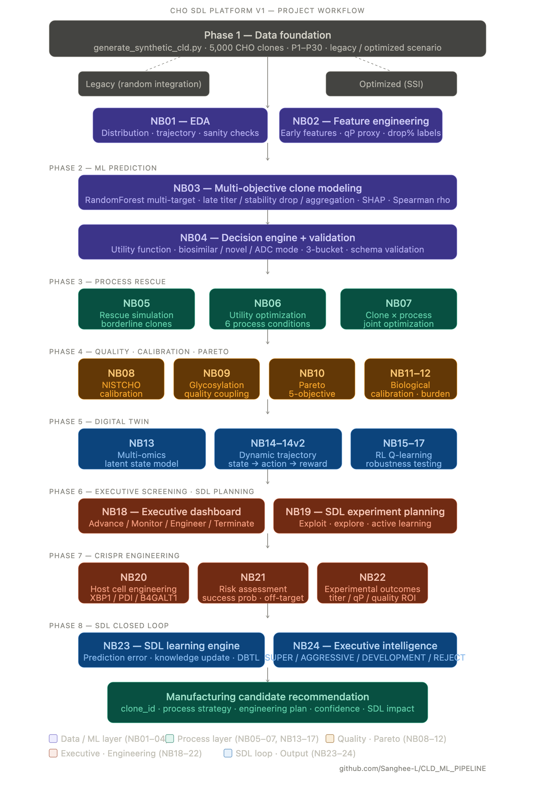
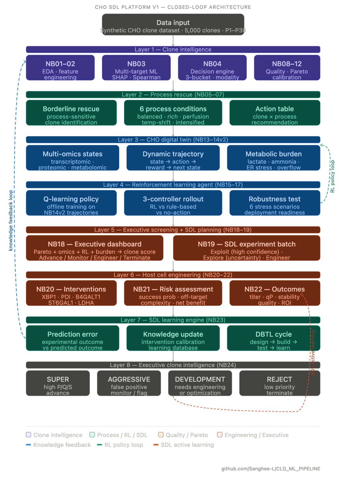
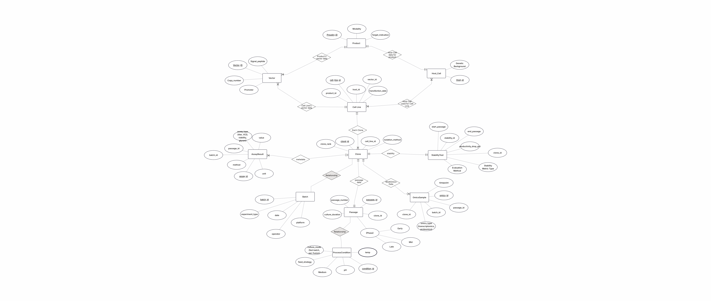

# CHO SDL Platform

Self-Driving Laboratory (SDL) for CHO Cell Line Development

An end-to-end computational platform integrating machine learning, digital twins, reinforcement learning, engineering simulation, and closed-loop SDL workflows for biologics development.

CHO SDL Platform is an AI-guided prototype that integrates machine learning, multi-objective optimization, digital twins, reinforcement learning, engineering simulation, and closed-loop Scientific Development Loop (SDL) workflows for CHO cell line development.

The goal is to identify high-value manufacturing candidates earlier, reduce experimental burden, minimize false-positive progression, and support data-driven development decisions.

---

## Problem

Traditional CHO cell line development requires extensive experimental screening, process optimization, and engineering campaigns.

Common challenges include:
 - Large number of candidate clones
 - High experimental cost
 - False-positive clone progression
 - Late-stage development failure
 - Limited integration of biological knowledge and computational learning

---

## Project Objectives

The platform focuses on five core objectives:

1. Prioritize promising CHO clones
2. Detect false-positive candidates early
3. Recommend engineering interventions
4. Reduce experimental burden
5. Enable continuous SDL learning

---

## Proposed Solution

The CHO SDL platform combines:
 - Machine learning-based clone screening
 - Multi-objective Pareto optimization
 - CHO digital twin simulation
 - Reinforcement learning policy optimization
 - Host cell engineering recommendation
 - Experimental outcome simulation
 - Closed-loop SDL learning

to support more efficient and data-driven clone development workflows.

---

## Platform Workflow

Figure 1. End-to-End SDL Workflow for CHO Cell Line Development


Figure 1 illustrates the end-to-end computational workflow from clone generation to final manufacturing candidate recommendation.

---

## Key Results

Using a synthetic CHO clone population:
 - 93 clones screened
 - 36 clones retained
 - 3 clones recommended for immediate advancement

### Experimental Burden Reduction
```
93 clones
      ↓
36 retained candidates
      ↓
3 immediate advancement candidates
```

96.8% reduction in final advancement workload
This reduction demonstrates how SDL-guided clone prioritization can decrease unnecessary experimental effort and focus resources on the highest-value candidates.


Additional capabilities demonstrated:
 * Multi-objective clone ranking
 * Engineering intervention simulation
 * SDL portfolio selection
 * Executive clone intelligence dashboard
 * Closed-loop knowledge feedback


## SDL Closed-Loop Architecture

Figure 2. Closed-Loop SDL Architecture


Figure 2 illustrates how experimental outcomes continuously update the SDL knowledge base and improve future recommendation.

The SDL engine continuously updates knowledge generated throughout the development workflow and feeds updated information back into future clone selection and optimization cycles.

---

## Platform Components

| Component | Purpose |
|-----------|---------|
| ML screening | Clone prioritization |
| Pareto Optimization | Multi-objective candidate selection |
| Digital Twin | Dynamic biological simulation |
| Reinforcement Learning | Process policy optimization |
| Engineering Engine | Intervention recommendation |
| Outcome Simulator | Experimental prediction |
| SDL Learning Engine | Knowledge accumulation |
| Executive Platform | Decision support |

---

## Repository Structure
``` 
CHO_SDL_PLATFORM/
├── data/
│   ├── sql/
│   └── synthetic/
├── docs/
├── examples/
├── notebooks/
├── reports/
│   ├── figures/
│   └── screenshots/
├── scripts/
├── src/
│   └── cho_sdl/
├── README.md
├── requirements.txt
├── LICENSE
└── .gitignore
```

---

## Data Model

The synthetic CLD dataset is organized using a relational schema designed to mimic a typical Cell Line Development (CLD) workflow.

### Entity Relationship Diagram (ERD)

Figure 3. Synthetic CLD database schema used throughout the CHO SDL platform.



### Core Entities
| Table | Description |
|-------|-------------|
| product | Therapeutic product being expressed (e.g., monoclonal antibody) |
| host_cell | Host cell background (e.g., CHO-K1, CHO-DG44) |
| vector | Expression vector metadata |
| cell_line | Transfected parental cell line |
| clone | Isolated production clones |
| passage | Longitudinal passage history for each clone |
| process_condition | Culture conditions applied at each passage |
| assay_result | Experimental measurements (titer, VCD, viability, aggregation, copy number, etc.) |
| batch | Assay execution batches used to introduce realistic batch effects |
| stability_test | Productivity stability labels derived from early vs. late passages |

### Synthetic Biology Design Principles
The synthetic dataset was designed to reproduce several common biological phenomena observed during CHO cell line development:
* Clone productivity follows a right-skewed distribution where a small number of clones become high producers.
* Productivity decays across passages according to clone-specific stability.
* High expression burden can suppress growth and viability during early passages.
* Growth and viability can partially recover as productivity declines over time.
* Product quality is influenced by both intrinsic clone quality and expression-related stress.
* Batch-level effects introduce realistic experimental variability.
* Platform-specific effects simulate differences between legacy and optimized CLD technologies.
* Rare clone subpopulations can exhibit jackpot or false-positive behaviors to challenge screening algorithms.

### Hidden Ground Truth
To support benchmarking and model validation, hidden latent variables are generated for every clone:

* Productivity potential (P)
* Stability potential (S)
* Quality potential (Q)

These latent variables are exported separately as validation datasets and are intentionally excluded from SQLite database tables to prevent machine-learning leakage.

Additional hidden variables are also generated for:

* Process-response behavior
* Stress adaptation
* Perfusion rescue potential
* Feed responsiveness
* Glycosylation tendencies
* Product quality consistency

These hidden factors support future digital twin, process optimization, and reinforcement learning workflows within the CHO SDL Platform.


---

## Environment

This project was developed using:
 - Python 3.11.15
 - Jupyter Notebook
 - numpy
 - pandas
 - scikit-learn
 - matplotlib
 - scipy
 - shap
 - openpyxl

Install dependencies:
```
pip install -r requirements.txt
```

---

## Generating Synthetic Data

Synthetic CLD datasets can be regenerated locally using:
```bash
python scripts/generate_synthetic_cld.py
```
By default, this generates the legacy scenario.

To generate the optimized scenario:
```bash
python scripts/generate_synthetic_cld.py --scenario optimized
```

Generated files are written to:
```
data/synthetic/raw/
```

Example generated files:
```
cld_5000clones_legacy.db
batch_effects_truths_5000_legacy.csv
clone_latent_truths_5000_legacy.csv
```

SQLite database files are not tracked in Git because they may exceed GitHub file-size limits.

---

## Running the V1 Workflow Guide

The repository includes a lightweight workflow guide that demonstrates the intended execution sequence of the V1 prototype.

Run:
```bash
python examples/run_v1_pipeline.py
```
This script serves as a roadmap for navigating the notebook-based workflow and illustrates how the platform components connect across the SDL pipeline.

Typical stages include:

1. Synthetic dataset generation
2. Data quality inspection
3. Early-passage feature engineering
4. Stability prediction
5. Clone prioritization
6. Pareto optimization
7. Digital twin simulation
8. Reinforcement learning optimization
9. Engineering recommendation
10. SDL portfolio selection
11. Executive decision support

Primary analyses are implemented in the notebooks/ directory.

Generated figures, reports, and outputs can be found in:

reports/

while notebook-based analyses are located in:

notebooks/

---

## Current Status

Version: v1.0.0 Prototype Complete

Implemented Components:

- 24 end-to-end notebooks
- Synthetic CLD data generator
- SQL schema
- Multi-stage clone screening workflow
- Digital twin framework
- Reinforcement learning optimization
- Engineering recommendation engine
- Closed-loop SDL workflow
- Executive decision dashboard

---

## Documentation

Additional documentation can be found in the docs/ directory:

- PROJECT_OVERVIEW.md
- ARCHITECTURE.md
- NOTEBOOK_SUMMARY.md
- RESULTS.md
- ROADMAP.md
- FUTURE_WORK.md

---

## Roadmap

### V1 – SDL Prototype (Current)

- Clone screening
- Pareto optimization
- Digital twin simulation
- Reinforcement learning
- Engineering recommendation
- Closed-loop SDL learning

### V2 – Data-Driven SDL

- Real-world CLD datasets
- Learned decision engine
- Bayesian uncertainty estimation
- Survival analysis
- Active learning

### V3 – Multi-Omics SDL

- RNA-seq integration
- ATAC-seq integration
- Proteomics
- Metabolomics
- Graph Neural Networks
- Transformer architectures

### V4 – PAT-Enabled Autonomous Bioprocessing

- Process Analytical Technology (PAT)
- Adaptive process control
- Real-time digital twins
- Online learning system
- Autonomous experiment recommendation

---

## Disclaimer

This project is a computational prototype designed to demonstrate an SDL-driven clone intelligence platform for CHO cell line development.

All results were generated using synthetic datasets and simulated engineering interventions.

The platform has not yet been validated using real CDMO datasets, manufacturing data, or wet-lab experiments.

The objective of this work is to demonstrate architecture, decision logic, and future SDL capabilities.

---

## Author

Scientist and engineer exploring the future of AI-guided biologics development, digital twins, reinforcement learning, and self-driving laboratories.
